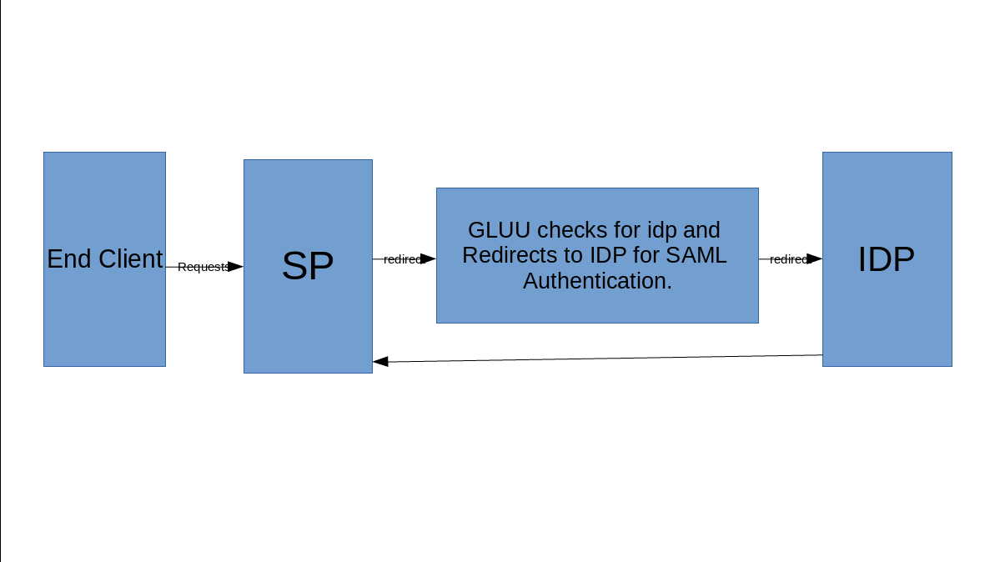

# Evolve IP Project

## Goals

### Enhance IDP Project with Passport script for SAML Authentication

We need to Authenticate user from IDP before user is authenticated on Gluu

Required flow of request from user:
- User requested to SP
- SP redirect user to gluu for login with request IDP encoded in base64 in state param
- Gluu extract state param and prepare request and IDP endpoint.
- Send Prepare Request to IDP Endpoint
	- Extract info(whatever required) from state
        - extract endpoint of IDP
	- Prepare request to send user on IDP
	- Redirect User to IDP
- After validating user from IDP its redirected back to SP.

The Image below show the Flow of Passport SAML Authentication

